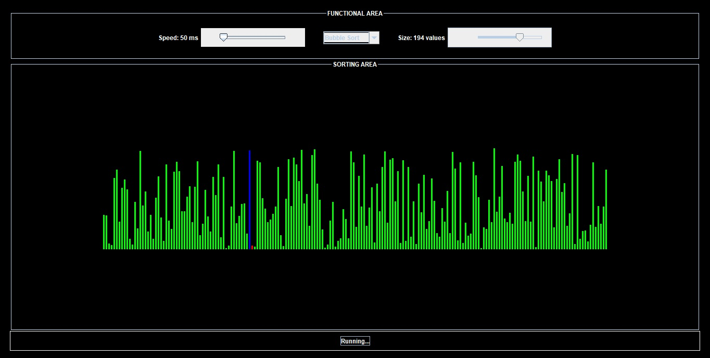
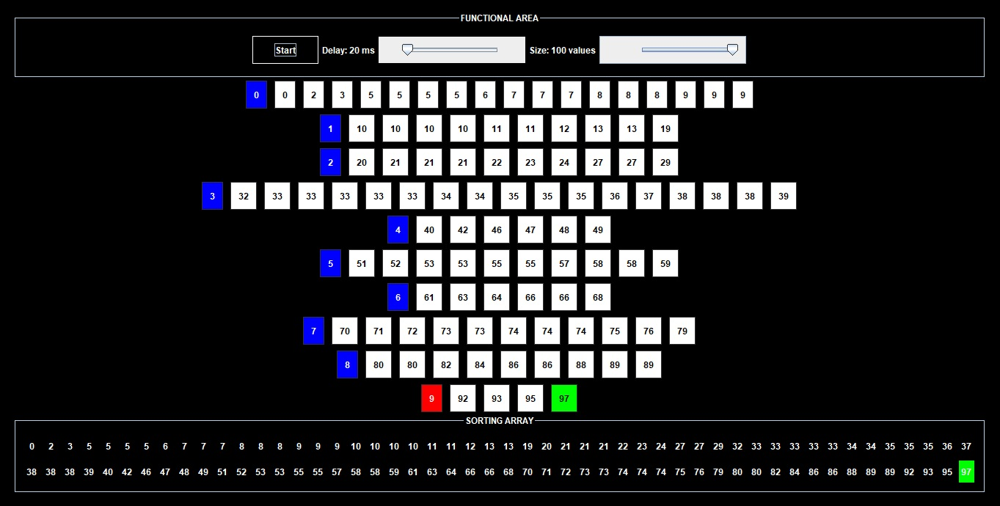

# MAD LIONS SORTING ALGORITHMS VISUALIZED

## Contributors

| Student            | ID       |
| ------------------ | -------- |
| Mai Anh Đức        | 20194740 |
| Vũ Phạm Việt Hoàng | 20194771 |
| Đinh Ngọc Khuê     | 20194782 |
| Trần Phúc Thành    | 20194846 |

## Overview

**Course:**

- Object-Oriented Language and Theory (Java)
- Lecturer: TS. Trần Nhật Hoá
- Course ID: _IT3102E_
- Class ID: _131098_ (Theory) - _131099_ (Laboratory)

**The project includes:**

- Bubble sort
- Selection sort
- Merge sort
- Bucket sort

## Usage

### Bubble, Selection & Merge Sort UI

### Bucket Sort UI

